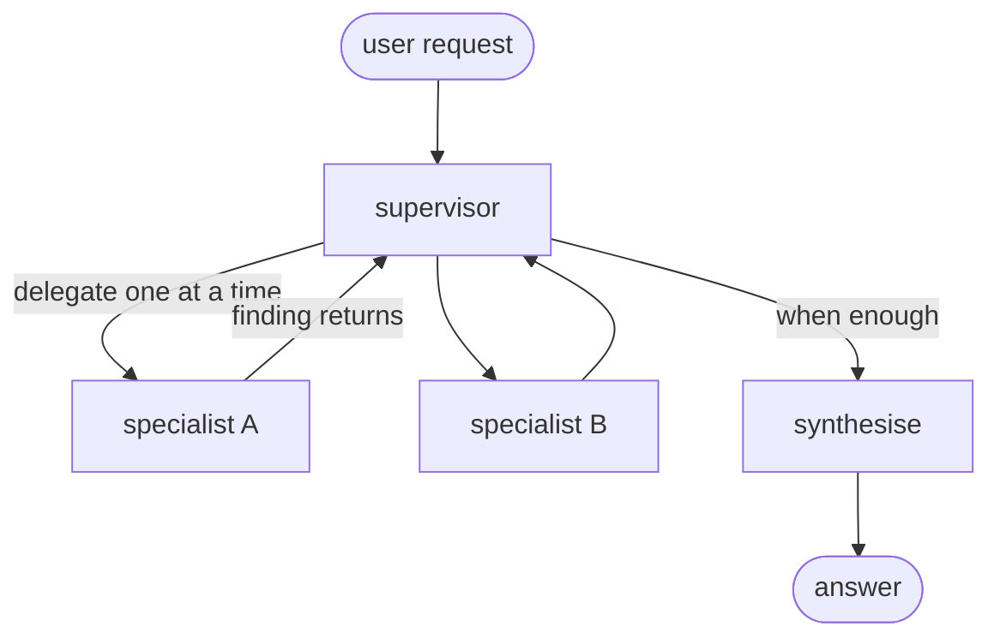
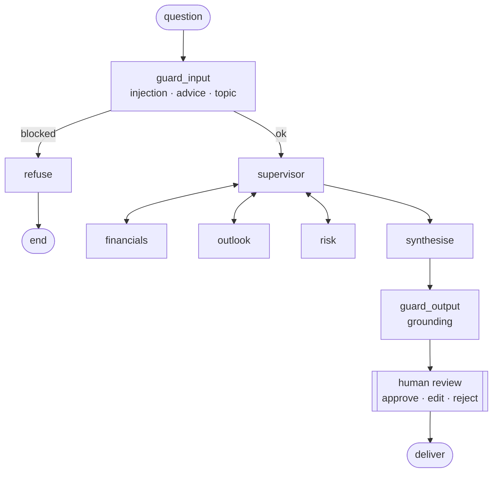
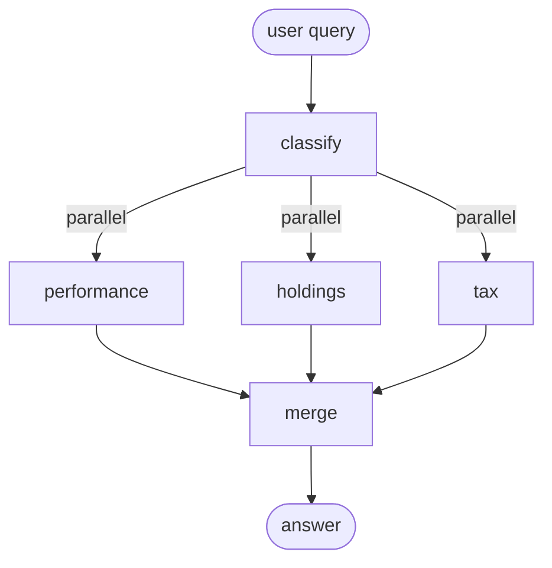
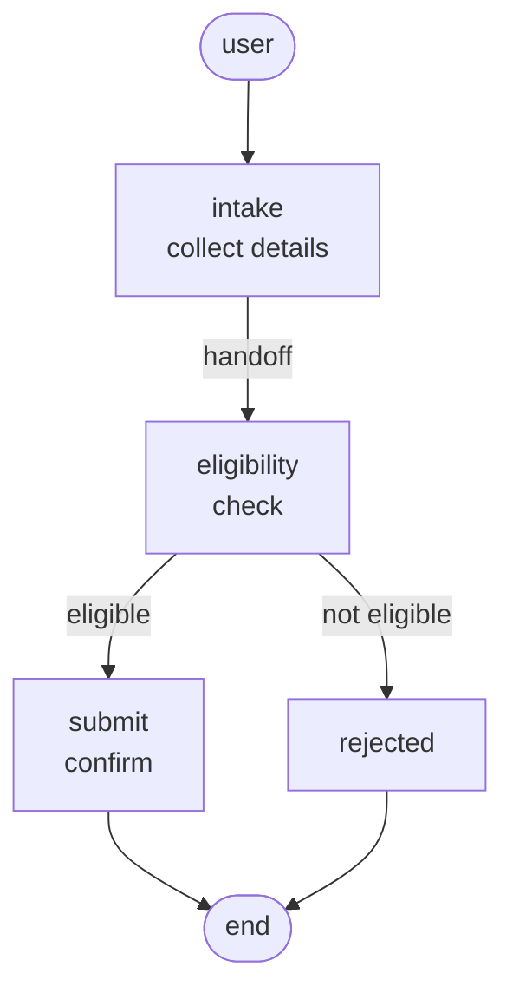
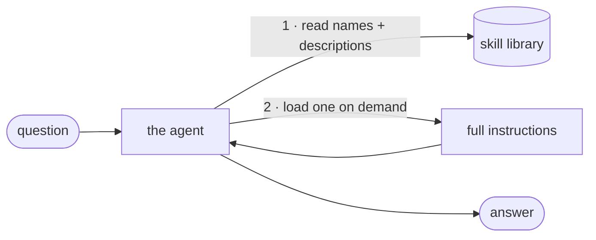

# Multi-Agent Architectures — a Foundational, Hands-On Guide


A build-it-yourself tour of the four multi-agent patterns every AI engineer should
know — **sub-agents, router, handoffs, and skills** — each as a small, runnable file
you can read top to bottom, plus **two applied projects** that take the ideas into
production territory (a guarded RAG with a human in the loop, and a live-data agentic
skills system).

Every pattern is taught the same way: a **mechanics file** that shows the control flow
with nothing else in the way, and — where it earns its place — an **applied build** on
the same idea. All examples stay in one domain (finance) so the *only* thing that
changes between them is the pattern.

---

## The one rule that comes before everything

> **Start with a single agent and good tools. Add tools before you add agents.
> Reach for these patterns only when a single agent genuinely hits a wall** —
> when one prompt can't hold all the knowledge, or when different teams must own
> different capabilities.

Multi-agent is powerful *and* expensive. This repo teaches the patterns so you know
which wall you're hitting and which pattern actually fixes it.

---

## The four patterns at a glance

Don't memorise four boxes — tell them apart with **three questions**:

| Pattern | Is there a boss? | State across turns? | Runs in parallel? | Reach for it when… |
|---|:---:|:---:|:---:|---|
| **Sub-agents** | ✅ supervisor | ❌ | ✅ | distinct domains need a coordinator; you want context isolation |
| **Router** | ✅ classifier | ❌ | ✅ | split a query across known verticals, run at once, merge |
| **Handoffs** | ❌ | ✅ | ❌ | a staged flow where each stage unlocks only after the last |
| **Skills** | ❌ (one agent) | ✅ (context grows) | ❌ | one agent with many optional specialisations, loaded on demand |

The **sub-agent** answers *who's in charge*; the **router** answers *how to fan out*;
**handoffs** answer *how to move through stages*; **skills** answer *how one agent
carries many capabilities without bloating its prompt*.

---

## Repository map

```
.
├── 1_Subagents/        Supervisor / orchestrator-worker (mechanics)
├── 2_SubAgenticRAG/    Applied: guarded, human-in-the-loop RAG (local Ollama)
├── 3_Router/           Classify → parallel dispatch → merge (mechanics)
├── 4_Handoffs/         Staged, stateful control transfer (mechanics)
├── 5_Skills/           One agent, load instructions on demand (mechanics)
├── 6_Skills/           Applied: agentic skills over live market data
├── requirements.txt
└── What are Subagents ?.pdf
```

---

## 1 · Sub-agents — centralized orchestration

A **supervisor** consults specialised sub-agents, reads what each returns, and
**re-delegates** until it has enough — then synthesises. The results coming *back* to
the supervisor, and it deciding again, is the whole pattern.



- **Domain:** a fund analyst — supervisor coordinates performance, holdings, risk, and fees specialists.
- **Run:** `export OPENAI_API_KEY=... && python sub_agents_foundational.py`

## 2 · Sub-Agentic RAG *(applied)*

The sub-agent pattern doing real work: each specialist **retrieves its own evidence**
from four quarterly earnings-call transcripts, wrapped in **guardrails** and a
**human-in-the-loop** review gate. Runs **fully local on Ollama** — data never leaves
the machine.



- **Guardrails:** prompt-injection, investment-advice (flag + human review, not blind refusal), topic scope, and output grounding.
- **Stack:** LangGraph · Ollama `qwen3:8b` · `nomic-embed-text`.
- **Run:** `ollama pull qwen3:8b && ollama pull nomic-embed-text` then `python subagentic_rag.py`. See `PROJECT.md` in the folder.

## 3 · Router — parallel dispatch and synthesis

A **classifier** decides which verticals a question touches, fires them **in parallel**,
and **merges once**. No loop, no supervisor between the workers — that missing back-edge
is the difference from sub-agents.



- **Run:** `export OPENAI_API_KEY=... && python router_foundational.py`

## 4 · Handoffs — state-driven stage transitions

No coordinator: the **active agent changes** as a conversation moves through stages,
each **handing control** to the next. State rides forward (a checkpointer), and a stage
**unlocks only after** the previous one finishes.



- **Domain:** a loan application — `intake → eligibility → submit`, where submit is unreachable unless eligibility passes.
- **Run:** `export OPENAI_API_KEY=... && python handoffs_foundational.py`

## 5 · Skills — progressive disclosure

The odd one out: **one agent, no graph of agents**. It knows only skill *names +
descriptions* at first, and loads a skill's *full instructions* only when a question
needs it. Cheap up front; loaded skills accumulate in context (the token-bloat
trade-off).



- **Run:** `export OPENAI_API_KEY=... && python skills_foundational.py`

## 6 · Agentic Skills — live market-risk analyzer *(applied)*

Skills done for real: each skill is a **`SKILL.md` file on disk with a bundled script**
that pulls **live Yahoo Finance data** and computes a **0–100 risk score** (volatility +
drawdown + beta). The agent runs a deterministic **plan → execute → interpret** flow —
it decides which skill(s) and arguments, code loads and runs them, then the model
explains the numbers.

```mermaid
flowchart LR
    Q([\"How risky is INFY.NS?\"]) --> PL[plan<br/>pick skills + args]
    PL --> EX[execute<br/>load SKILL.md · run script]
    EX --> YF[(Yahoo Finance)]
    YF --> EX
    EX --> IN[interpret<br/>plain-language answer]
    IN --> Z([answer])
```

- **Skills:** `risk_score`, `market_snapshot`, `portfolio_risk` (each a `SKILL.md` + script).
- **Run:** `export OPENAI_API_KEY=... && python skills_agent.py "How risky is INFY.NS?"`
  Tickers use Yahoo format — `.NS` for NSE (e.g. `RELIANCE.NS`), bare symbols for US.

---

## When to use which — decision guide

Walk down; stop at the first match.

1. **Can one agent + good tools do it?** → do that.
2. **A staged conversation where stages unlock in order?** → **Handoffs.**
3. **One agent, many optional specialisations?** → **Skills.**
4. **Split a query across known verticals, run in parallel, merge?** → **Router.**
5. **Distinct domains needing a coordinator, context isolation, parallel work?** → **Sub-agents.**

And gate it all with one question: **is the task valuable enough to pay the extra
tokens?** Multi-agent systems can use ~15× the tokens of a single chat — worth it for
valuable, parallelisable, context-heavy work; wasteful otherwise.

---

## Setup

```bash
pip install -r requirements.txt
```

Two model stacks are used, by design:

| Where | Model | Needs |
|---|---|---|
| Foundational files (1, 3, 4, 5) & Agentic Skills (6) | **GPT-4o** | `OPENAI_API_KEY` |
| Sub-Agentic RAG (2) | **Ollama** `qwen3:8b` + `nomic-embed-text` | a local Ollama install (runs offline) |
| Agentic Skills (6) — data | **Yahoo Finance** via `yfinance` | an internet connection |

---

## Credits & sources

Built as teaching material by **[Tarka Upskilling and Engineering Co.](https://tarkaupskilling.com)** —
enterprise AI training. Grounded in two excellent write-ups worth reading in full:

- LangChain — [*Choosing the Right Multi-Agent Architecture*](https://www.langchain.com/blog/choosing-the-right-multi-agent-architecture)
- Anthropic — [*How we built our multi-agent research system*](https://www.anthropic.com/engineering/multi-agent-research-system)

> **Note:** the finance examples (funds, tickers, transcripts, risk scores) are for
> teaching only. Nothing here is financial advice, and the synthetic company data is
> fictional.
